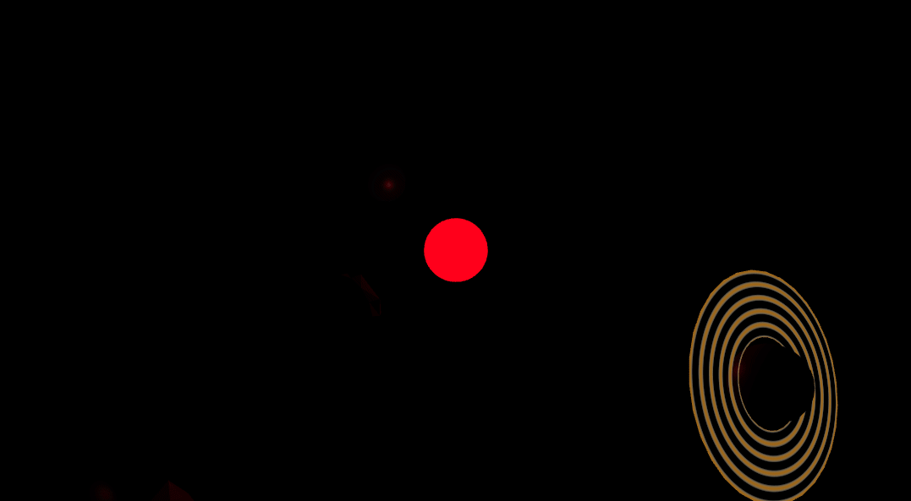
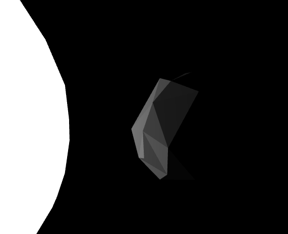
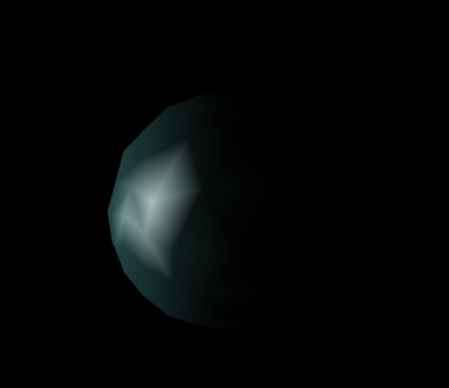
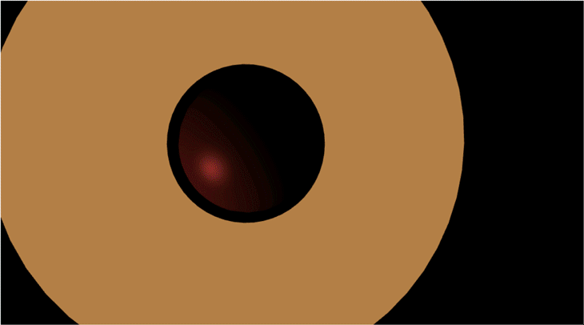
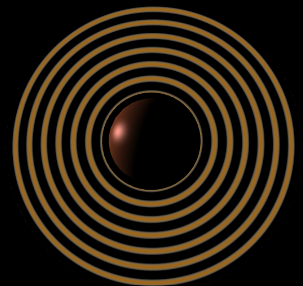
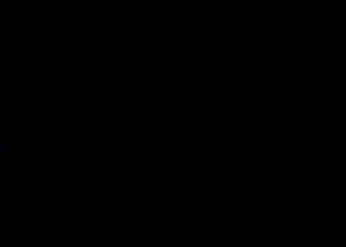
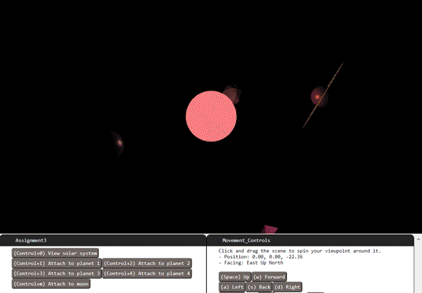

[](https://classroom.github.com/online_ide?assignment_repo_id=6176987&assignment_repo_type=AssignmentRepo)
# Assignment #3

### Basic Info:

* This assignment is **graded**, and it worth 25 pts (out of 500 pts in total).
* The deadline is 11/07 11:59 PM.
    * If the Syllabus and/or class notification made by instructor or TAs indicates a different DDL, please refer to the latest information.

### Repository setup:

1. By now you have followed the link to create your assignment repository. The repository name should lool like `CS174A-21F-A3-[Github-ID]`. 

2. You should also be sure to share your GitHub username with us via this link if you have not already. 

   * You should also be sure to setup your local git environment and ssh keys to work with GitHub.

3. Once your repository is created you will have a copy of the assignment template in your github repository. Now you can clone the repository onto your local computer using the following command. Be sure do execute this command from the directory you wish to locate your work.

4. You can now follow the remaining steps of the assignment. This [debugger instruction](https://docs.google.com/document/d/e/2PACX-1vSi14Mb-_6qLN7wVA4-4NxqYR-3qHLy7ndjB2G0Ba6TCYHn_KGmrPbu-fCDtHkv9QcGBNqLUUdT6fu1/pub) can be helpful when your code does not work. 

### Gettting Started:

When you open your project, you will see a file `assignmetn3.js` that draws a single Torus shape (donut).  Replace this scene with the solar system we specify in detail below. 

Items in your code for you to fill in are marked `TODO`.  You can also edit code outside of there.

Use our provided initial camera matrix that looks diagonally down at the scene, far back enough to see the entire scene.

Instantiate four spheres with each of 1, 2, 3, and 4 for the number of subdivisions. You may take advantage of previously given code for spheres.

For the sphere instances that have 1 or 2 subdivisions, use flat shading to build them. If you feel that you have to make edits in the code in places that are unspecified that is also fine but make sure to at least call the functions in the places that we state.

>  **Flat Shading:** In a flat shaded shape, all three corner points of a triangle have identical normal vectors, with all three vectors being exactly perpendicular to the triangle's planar face.  Flat shading means more than just setting normal vectors, though; it also requires us to use a more restricted way of connecting vertices into triangles.  We need to produce sharp, clearly defined edges on shapes.  To do that, the process of flat shading a shape must ensure that the vertices along a sharp edge _do not get shared_ by the triangles on either side of the edge.  When triangles share references to a vertex, it saves storage space, but it also forces both triangles to use the same data at that point; not just position, but also normal vector, texture coordinate, etc.  When we want an abrupt transition across an edge, though, we'd like the single edge to have different normal vectors depending on which triangle we're approaching the edge from.  To get the flat shading effect, we cannot make our triangles share references to the same vertex, but instead must have duplicate vertices where sharp edges are.  The duplicate vertices overlap in position, but with different normal vectors.  That completes the effect.  To flat shade an entire shape, all vertices must be unique, and no triangles can share any vertices.  Exceptions can be made where faces are co-planar but that never happens in our spheres.

If you don't want to re-invent the sphere algorithm to make a flat-shaded version, you may use the `make_flat_shaded_version()` function built into our `Shapes`.  To call it on a shape with class name N, wherever N appears simply replace it with the code `( N.prototype.make_flat_shaded_version() )`, including the outer parenthesis.

>  **Materials:**  Recall that all Material objects really come from calling class `Material(shader, options)` .  For this project we'll use the provided `Phong_Shader`and create two new shaders `Gouraud_Shader` and `Ring_Shader`.  What are materials, besides objects that hold a color?  Well, they also store more settings for Phong shading, including numbers found in the Phong Reflection Model like the ambient coefficient, diffuse coefficient, specular coefficient, and shininess exponent.  You can pass all of these values in inside a JavaScript object placed after the `Color` parameter when you construct a `Material`, mimicking how our example `Material` instances do it.  You can assign values to ambient, diffuse, and specular (leave shininess as the default).  These coefficients range from zero to a maximum of one.

Draw the following scene in the `display()` function of `Assignment3`.





### Graded Steps

#### Up to 25 points of credit. There is no partial credit on any individual requirement. 

Implement the assignment in clean and understandable code. Each required part must successfully draw and show up onscreen in order to count.

**If any parts are unclear, ask on Piazza.**

#### Point distribution

1. Place a spherical sun at the origin.  Use a sphere that is **subdivided 4 times**.  Use **maximum ambient** in the material.  It **swells from radius 1 up to 3** over **a 10 second period**, and fades from **red** when it's smallest to **white** when it's biggest. **- 2 points.**

2. Make a point light source of **the same color of the sun** located in the center of the sun, with a **size parameter** equal to `10**n` where n is the current sun radius.  In JavaScript, `**` is the exponent operator.  Since the light's size is changing and not the brightness, you should see the outer planets darken more than the inner ones whenever the sun shrinks. **- 2 points.**

3. Place four orbiting planets.  Their **radius shall all be 1.**  The smallest orbit shall be **5 units away from the sun** and each orbit after shall be **3 units farther**, with each **farther** planet revolving at a slightly **slower** rate than the previous.  **Leave the ambient lighting of each planet the default value of zero**. **- 5 points.**

4. Planet descriptions, from the innermost to the outermost:
   
   **Planet 1:**  Gray, 2 subdivisions, flat shaded, **diffuse only**. **- 3 points.**

   

   **Planet 2:**  Swampy green-blue (suggest color `#80FFFF`), 3 subdivisions, maximum specular, low diffuse.  Apply **Gouraud shading** to it every odd second, but **Phong shading** every even second. **- 4 points.**

   >  **To Gouraud shader:**  Edit the class `Gouraud_Shader` and create the Gouraud shader from the current Phong shader template. Find the code that calculates the Phong formula.  It's in a GLSL function called `phong_model_lights()`.  Observe how either the vertex shader or fragment shader programs have the ability to call `phong_model_lights()` to compute the Phong color.  To perform Gouraud shading, make sure the color calculation occurs in the vertex shader.  Otherwise, to perform phong shading, this process waits to call `phong_model_lights()` until the fragment shader.  Remember that with Gouraud shading, the fragment shader interpolates colors; with phong shading, the fragment shader interpolates normals.

   

   **Planet 3:**  Muddy brown-orange (suggest color `#B08040`), 4 subdivisions, maximum diffuse and specular.  The planet must **wobble** on in its rotation over time (have an axis not the same as the orbit axis).  The planet must have a ring.  You can use the provided torus shape, scaled flatter (reduced z axis scale).  The ring and planet must wobble together - so base the ring's matrix directly on the planet's matrix.  Give the ring the same color as the planet and set the material ambient only (for now). **- 2 points.**

      > The 2 points here is for setting the correct material for the sphere of Platnet 3, and the correct transformation for wobbling and the ring. The material of the ring is not considered, since we will use a special shader to render it in the next requirement.

   

   Next, give your planet 3's ring a custom shader, drawing repeated faded bands on it like Saturn.  All you have to do is make sure it calculates color brightnesses in a way that varies sinusoidally with distance from the planet's center. **- 4 points.**

   The `Ring_Shader` class already partially implements such a custom shader.  It works with any `Shape` that has a `position` field, and ignores all other fields.  Draw with this shader by using one of its materials (it generates blank ones, which is ok).  When used, it already passes in for the GPU to use the following values:  The shape positions, the model transform matrix, and the product of the projection and camera matrices.  These values are available in the shader's GLSL code.

   Your task is to use those available variables to fill in the GLSL shader code (the JavaScript template strings returned by `vertex_glsl_code()` and `fragment_glsl_code()`).  Specifically, the `void main()` is blank for both the vertex and fragment shader programs; fill these in to cause the GPU to store within the special GPU address called `gl_Position` the correct final resting place of the vertex, and store into `gl_FragColor` the correct final color.
   
   For testing, you can try storing simple placeholder values into those special variables -- such as the original model space position value, converted from a `vec3` to a `vec4` like this: `vec4( object_space_pos, 1)`.
   
   To color the ring use the color of planet 3, multiplied by some sinusoidal scalar function of your distance calculation, so that the color fades over distance from the center.  Use the GLSL `distance()` function to compute distance.  Both position and center are variables that you should calculate and store within the vertex shader; because we declared them as varying, they will be passed on to the fragment shader and available there.
   
   The ring color need not be affected by lights (the sun's size), since it is using a simple shader that is not aware of lights.

   
   
   **Planet 4:**  Soft light blue, 4 subdivisions, smooth phong, high specular.  **Add a moon** for this planet.  The moon has 1 subdivision, with flat shading, any material, and a small orbital distance around the planet. **- 2 points.**
   
   
   
5. Camera buttons: To help us grade, we have implemented some buttons.  They are visible on your program, but they do not work at first. These buttons are intended to attach the camera to each planet, one at a time, fixed upon the front of the planet for closer viewing.

   In order for these buttons to start working, your `display()` function must assign new values to your camera matrix.  Your `display()` function must also fill in the following class-scope variables with the correct planet's model matrix: `"this.planet_1"` `"this.planet_2"` `"this.planet_3"` `"this.planet_4"` `"this.moon"` and, possibly, extra credit `"this.planet_5"` (see below).

   Once you have those, the buttons will now set the function `this.attached()` to return the matrix of the planet we want.  This is like storing a pointer to the planet's matrix that will always be up-to-date with new values of it.  In JavaScript when we want a long-term pointer to a variable we often use a function returning a variable (a closure) instead.

   Now you must call `this.attached()` to assign to the camera matrix.  Only do the following when the value of `this.attached` is not undefined (so, when a button has already been pressed).  Somewhere in `display()`, compute the desired camera matrix (let's call the matrix "`desired`") by calling `this.attached()`, translating the returned value by 5 units to back away from the planet (we don't want to be inside of it), and then inverting that matrix (because it's going to be used for a camera, not a shape).  Set the camera position as `desired` with function`program_state.set_camera(desired)` or update `program_state.camera_inverse` to `desired` **- 4 points.**  

6. This is a slight modification to what you'll do for the last sentence you just read in part 5.  This will smooth out camera transitions more and give you slightly more control while attached. Instead of directly assigning `desired` to `program_state.camera_inverse`, blend it with the existing camera matrix (from the previous frame) so that we smoothly pull the camera towards equaling `desired` instead of immediately getting there.  To mix two matrices, you can use `desired.map((x,i) => Vector.from(program_state.camera_inverse[i]).mix(x, blending_factor))` where 0.1 would make a good blending factor. **- 1 points.**

   NOTE: At a blending speed of 0.1, you will still have some leeway to control the camera while attached (especially mouse steering), although it will tend to pull you back to viewing the selected planet.  As you press the buttons, see if you can notice any undesired effects of blending matrices this way to generate intermediate camera matrices -- a subtle problem can be seen because our code snippet above uses linear blending instead of quaternions.

   

### Submitting assignment on GitHub:

1. Once you are finished working it is time to 'commit' your work to your remote repository on GitHub. You will also want to do this periodically while you are working to make a backup of your work and to make your final submission. We will keep the process very simple by just 'committing' the master branch of your local repository into the remote repository on GitHub.

2. The first step is to add any new files into the repository so they can be tracked.

    ```bash
      $ git add *
    ```

3. Then we commit any new and or changed files to the repository. The text after the -m is for you to describe what is included in this commit to the repository.

    ```bash
      $ git commit -m "Description of what I did"
    ```

4. Finally, we need to push these changes up to our remote repository on GitHub. This is a very important step! Without it you are not copying your work back to GitHub and we will not be able to see it if you forget.

    ```bash
      $ git push origin master
    ```
    If you find this confusing or still need help with setting up github please use this link https://product.hubspot.com/blog/git-and-github-tutorial-for-beginners

5. You can repeat these commands as often as you feel the need as your work on your assignment. However, again, you must always make a final push to GitHub when you are finished in order to submit your work. We will make a clone of all of the assignment repositories at the deadline. That implies two things. First, make your final push to GitHub ahead of time and second, any pushes you make after the deadline will not be seen by us.

6. Assignment is due on time - any commits done after `11:59`pm won't be considered and the assignment will be considered <strong>late</strong>.
